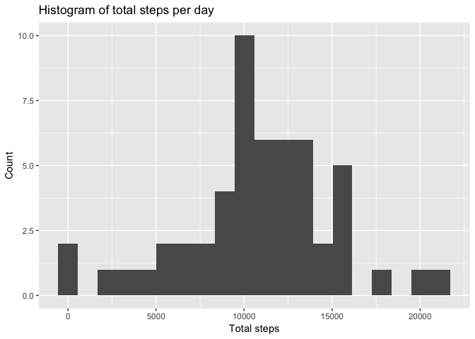
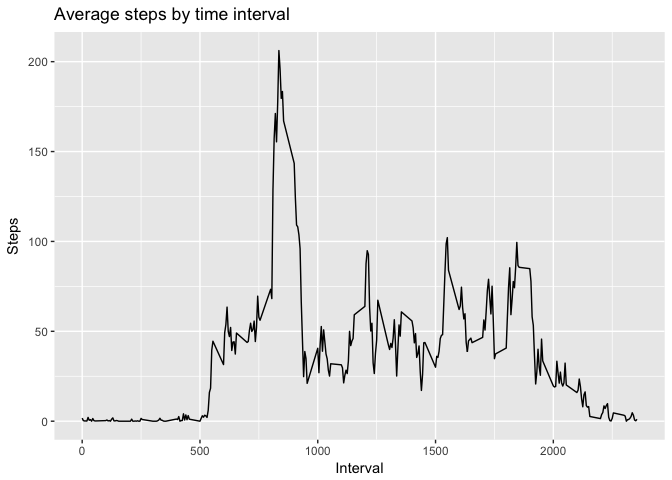
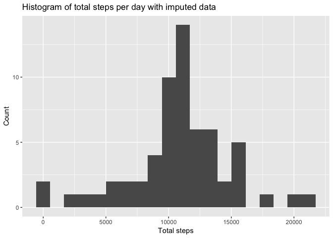
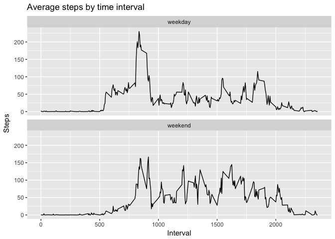

# Reproducible Research: Peer Assessment 1
Adriana Clavijo  


This assignment makes use of data from a personal activity monitoring device. 
This device collects data at 5 minute intervals through out the day. The data 
consists of two months of data from an anonymous individual collected during the
months of October and November, 2012 and include the number of steps taken in 
5-minute intervals each day.

## Loading and preprocessing the data


```r
data_dir <- "./raw-data/"

if(!dir.exists(data_dir)){
    dir.create(data_dir)
}

unzip("activity.zip", exdir = data_dir)

data_file <- paste0(data_dir, "activity.csv")

ind_data <- read.csv(file = data_file, stringsAsFactors = FALSE)
```


```r
ind_data[, "date"] <- as.Date(ind_data[, "date"])
```

## What is mean total number of steps taken per day?


```r
steps_day <- ind_data %>% 
    group_by(date) %>% 
    summarise(Total_steps = sum(steps)) %>% 
    ungroup()

mean_steps <- mean(steps_day$Total_steps, na.rm = TRUE)

median_steps <- median(steps_day$Total_steps, na.rm = TRUE)
```

The mean of the total steps per day is 10766.19 and the median 
is 10765. The following plot shows the histogram of the data.


```r
ggplot(data = steps_day, aes(Total_steps)) +
    geom_histogram(bins = 20) + 
    labs(x = "Total steps", y = "Count",
         title = "Histogram of total steps per day")
```

<!-- -->


## What is the average daily activity pattern?


```r
avg_steps <- ind_data %>% 
    group_by(interval) %>% 
    summarise(Avg_steps = mean(steps, na.rm = TRUE)) %>% 
    ungroup()

max_steps <- max(avg_steps$Avg_steps)

max_int <- avg_steps[avg_steps$Avg_steps == max_steps, ]$interval
```

The 5-minute interval that contains the maximum average is 835. This
maximum can be easily seen in the figure below.


```r
ggplot(data = avg_steps, aes(x = interval, y = Avg_steps)) +
    geom_line() + 
    labs(x = "Interval", y = "Steps",
         title = "Average steps by time interval")
```

<!-- -->


## Imputing missing values


```r
total_nas <- sum(is.na(ind_data$steps))

imputed_data <- ind_data %>% 
    left_join(avg_steps, by = "interval") %>% 
    mutate(steps = ifelse(is.na(steps), round(Avg_steps), steps)) %>% 
    select(steps, date, interval)
```

The number of missing values in the dataset is 2304, so I decided to 
impute those missing values with the rounded value of the average steps for the
corresponding interval.

The histogram of the imputed data is shown below.


```r
steps_day_imp <- imputed_data %>% 
    group_by(date) %>% 
    summarise(Total_steps = sum(steps)) %>% 
    ungroup()

mean_steps_imp <- mean(steps_day_imp$Total_steps, na.rm = TRUE)

median_steps_imp <- median(steps_day_imp$Total_steps, na.rm = TRUE)

ggplot(data = steps_day_imp, aes(Total_steps)) +
    geom_histogram(bins = 20) + 
    labs(x = "Total steps", y = "Count",
         title = "Histogram of total steps per day with imputed data")
```

<!-- -->

The mean of the total steps for the imputed data is 10765.64
and the median is 10762. Both measures are a little smaller than 
before but the difference is not substantial.


## Are there differences in activity patterns between weekdays and weekends?


```r
imputed_data <- imputed_data %>% 
    mutate(day = weekdays(date),
           weekday = ifelse(day %in% c("Saturday", "Sunday")
                            , "weekend", "weekday") %>% 
               as.factor())

avg_weekdays <- imputed_data %>% 
    group_by(weekday, interval) %>% 
    summarise(avg_steps = mean(steps)) %>% 
    ungroup()

ggplot(data = avg_weekdays, aes(x = interval, y = avg_steps)) +
    geom_line() +
    facet_wrap(~weekday, ncol = 1) +
    labs(x = "Interval", y = "Steps",
         title = "Average steps by time interval")
```

<!-- -->

It can be observed in the plot above that the maximum value of the average steps 
occurs during the weekdays and the variance is higher during the weekend.
